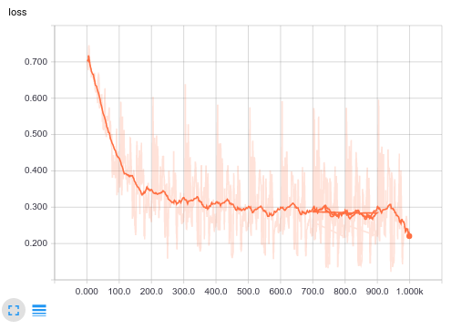
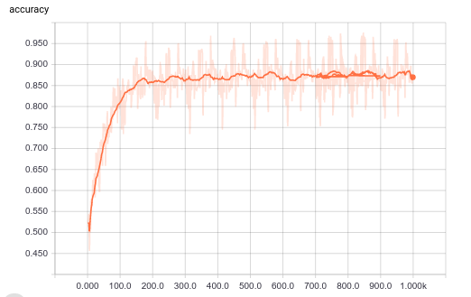
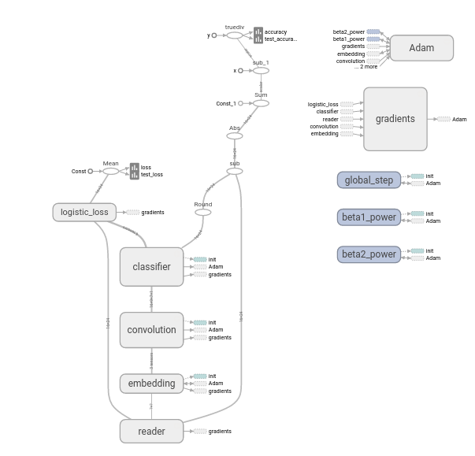
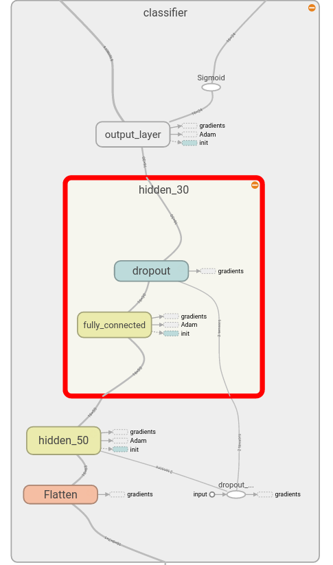
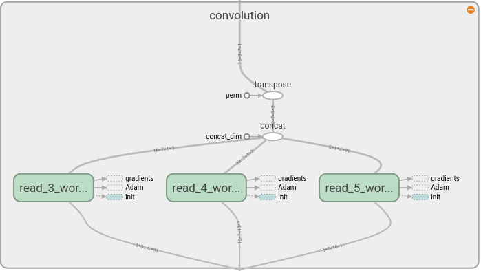
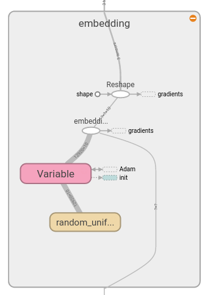
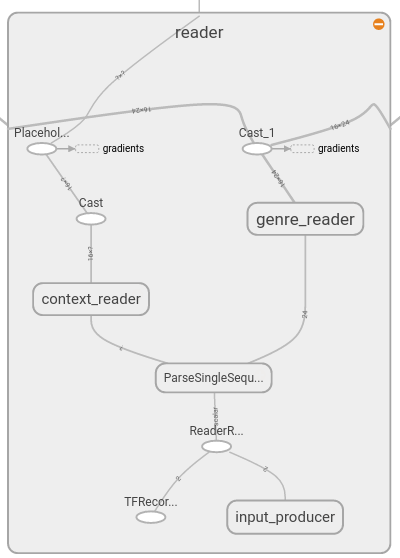

# Movie Dialog classification

[Cornell Movie Dialog](https://www.cs.cornell.edu/~cristian/Cornell_Movie-Dialogs_Corpus.html) 
classification with convolution layers.

It is slightly simplified implementation of Kim's [Convolutional Neural Networks for Sentence Classification](http://arxiv.org/abs/1408.5882) paper in Tensorflow.

## Usage

- To (Download and) preprocess data `./data.py`
- To create model graph, and test data flow `./model.py`
- To train (existing or new) model `./train.py`
- To get actual options use `-h` or `--help` flag after `./script.py`
- Dependency: (((data) model) train)

## Requirements

- Python 3
- Tensorflow > 0.12
- Numpy
- Possibly [update][update] required for Google Protobuf library if TFRecord is slow
[update]: https://github.com/tensorflow/tensorflow/blob/master/tensorflow/g3doc/get_started/os_setup.md#protobuf-library-related-issues
## TensorBoard snapshots
### Loss and accuracy

# Graph overall view

##  Classifier

## Convolution

## Embedding

## Reader

# References

- **Denny's blog post on [text classification](http://www.wildml.com/2015/12/implementing-a-cnn-for-text-classification-in-tensorflow/)**
- [A Sensitivity Analysis of (and Practitioners' Guide to) Convolutional Neural Networks for Sentence Classification](http://arxiv.org/abs/1510.03820)
- [Indico blog post on Protobufs and Queues](https://indico.io/blog/tensorflow-data-inputs-part1-placeholders-protobufs-queues/)

